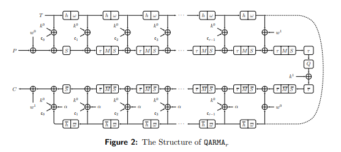

# wrapped_qarma
This is a wrapper around a small-area QARMA64 cipher core, for use in the Zero-to-Asic Group Submission.

It implements a small MMIO interface on the Wishbone bus.

# License
This project is [licensed under Apache 2](LICENSE)
